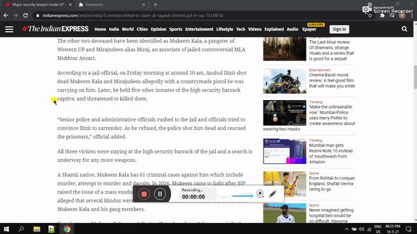

# Mnemonic Dictionary Chrome Extension

Easily search for mnemonic meanings of any word using [MnemonicDictionary.com](https://mnemonicdictionary.com) — just right-click on selected text in your browser!

---

## Features
- Adds a context menu item for quick mnemonic lookup
- Opens results in a new tab on MnemonicDictionary.com
- Simple, lightweight, and privacy-friendly

## Demo

---

## Installation
1. Download or clone this repository to your computer.
2. Open Google Chrome and go to `chrome://extensions/`.
3. Enable **Developer mode** (top right).
4. Click **Load unpacked** and select the extension folder.
5. The extension icon should appear in your browser.

## Usage
1. Select any word or phrase on a webpage.
2. Right-click and choose **"Search MnemonicDictionary for '[your selection]'"**.
3. A new tab will open with mnemonic meanings for the selected word on MnemonicDictionary.com.

## Permissions
- `contextMenus`: To add the right-click menu item.
- `tabs`: To open the search results in a new tab.

## Development
- Built using [Chrome Extension Manifest V3](https://developer.chrome.com/docs/extensions/mv3/intro/).
- Main logic in [`background.js`](background.js)
- Configuration in [`manifest.json`](manifest.json)

## Contributing
Pull requests and suggestions are welcome! Please open an issue or submit a pull request for improvements or bug fixes.

## Support
If you like this extension and want to support its development, you can buy me a coffee:

---

**Made with ❤️ for language learners and word enthusiasts!**
